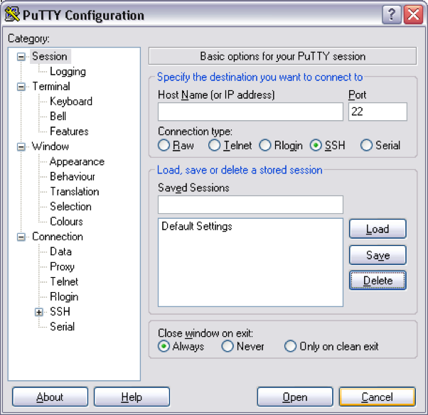

# Install Kubernetes on AWS
## Lab Environment Details
- **3 VMs**: 1 Leader node + 2 Follower nodes
- **OS**: Ubuntu 24.04 LTS
- **Kubernetes Version**: 1.30.0 (current stable)

## Log into all servers 
### MacOS 
Run the following commands in a terminal 
```
chmod 600 /path/to/lab.pem
ssh -i /path/to/lab.pem ubuntu@<LEADER_IP>     # Leader
ssh -i /path/to/lab.pem ubuntu@<FOLLOWER_1_IP> # Follower 1  
ssh -i /path/to/lab.pem ubuntu@<FOLLOWER_2_IP> # Follower 2
```

### Windows 
Open Putty and configure a new session. 
  



Expand “Connection/SSH/Auth and then specify the PPK file 


 Now save your session 


## Install Kubernetes on all servers

Following commands must be run as the root user. To become root run: 
```
sudo su - 
```

**IMPORTANT**: Run these commands on ALL THREE servers (leader and both followers)

### Update system and install dependencies
```
apt-get update && apt-get install -y apt-transport-https ca-certificates curl gpg
```

### Add Kubernetes official GPG key and repository (updated for 2024)
```
curl -fsSL https://pkgs.k8s.io/core:/stable:/v1.30/deb/Release.key | gpg --dearmor -o /etc/apt/keyrings/kubernetes-apt-keyring.gpg
echo 'deb [signed-by=/etc/apt/keyrings/kubernetes-apt-keyring.gpg] https://pkgs.k8s.io/core:/stable:/v1.30/deb/ /' | tee /etc/apt/sources.list.d/kubernetes.list
```

### Verify container runtime
Docker is already installed and running on the VMs. Kubernetes will use Docker as the container runtime.
```
docker --version
systemctl status docker
```

### Install Kubernetes packages
```
apt-get update
apt-get install -y kubelet=1.30.0-1.1 kubeadm=1.30.0-1.1 kubectl=1.30.0-1.1
```

### Configure system for Kubernetes
```
# Enable IP forwarding
echo 'net.ipv4.ip_forward = 1' >> /etc/sysctl.conf
sysctl -p

# Disable swap
swapoff -a
sed -i '/ swap / s/^\(.*\)$/#\1/g' /etc/fstab
```

The kubelet is now restarting every few seconds, as it waits in a `crashloop` for `kubeadm` to tell it what to do.

### Initialize the Leader
**ONLY run this command on the LEADER node**

```
kubeadm init --kubernetes-version=1.30.0 --cri-socket=unix:///var/run/cri-dockerd.sock --ignore-preflight-errors=all
```

If everything was successful output will contain 
````
Your Kubernetes control-plane has initialized successfully!
````

Note the `kubeadm join...` command, it will be needed later on.

Exit to ubuntu user 
```
exit
```

Now configure server so you can interact with Kubernetes as the unprivileged user. 
```
mkdir -p $HOME/.kube
sudo cp -i /etc/kubernetes/admin.conf $HOME/.kube/config
sudo chown $(id -u):$(id -g) $HOME/.kube/config
```

### Pod overlay network
Install Weave CNI plugin on the leader node (**ONLY on the LEADER node**)
```
KUBEVER=$(kubectl version | base64 | tr -d '\n')
kubectl apply -f https://reweave.azurewebsites.net/k8s/net?k8s-version=$KUBEVER
```

Wait until `coredns` pod is in a `running` state. This can take a few minutes
```
kubectl get pods -n kube-system
```

### Join nodes to cluster 
Log into each of the follower nodes and run the join command from `kubeadm init` control-plane output. 

The join command will look something like this:
```
kubeadm join <LEADER_IP>:6443 --token <token> --discovery-token-ca-cert-hash <hash> --ignore-preflight-errors=all --cri-socket=unix:///var/run/cri-dockerd.sock
```

**IMPORTANT**: Use the join command from your kubeadm init output, and add `--ignore-preflight-errors=all` `--cri-socket=unix:///var/run/cri-dockerd.sock`.

To confirm nodes have joined successfully log back into master and run 
```
watch kubectl get nodes 
````

When they are in a `Ready` state the cluster is online and nodes have been joined. 

# Congrats! 
