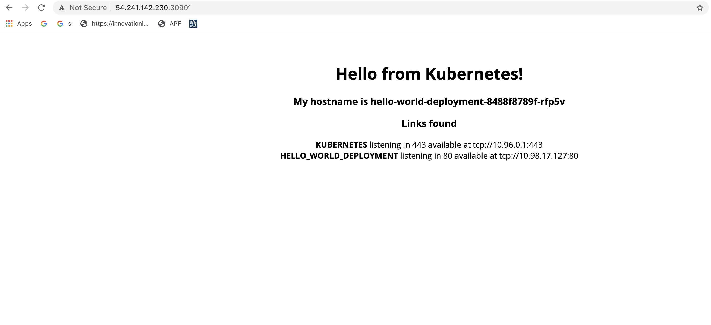

# First Kubernetes Deployment
In this lab, we’ll create a simple deployment with several replicas and a basic web server. After that, we’ll deploy a series of deployments to configure a fully functional monitoring service for Kubernetes.

## Cleanup all previous deployments
To ensure we have enough resources, let's delete our previous deployments.
```
kubectl delete all --all
```

Confirm all objects were deleted: 
You should only see the `kubernetes` service
```
kubectl get all
```


## Create a Deployment manifest(Pod, Service, Replicas) 
Using your favorite editor (Vim, Nano, Emacs) create a file called `hello-world.yaml` with the following content: 
**NOTE** the “selector” app field is the same as the deployment metadata app field.
**NOTE** that Kind is Service and Deployment, also, note the statically declared `NodePort`.
```yaml
apiVersion: v1
kind: Service
metadata:
  labels:
    name: hello-world-deployment
  name: hello-world-deployment
spec:
  selector:
    app: hello-world
  type: NodePort
  ports:
  - name: hello-world-deployment
    protocol: TCP
    port: 80
    nodePort: 30901
---
apiVersion: apps/v1
kind: Deployment
metadata:
  name: hello-world-deployment
spec:
  replicas: 3
  selector:
    matchLabels:
      app: hello-world
  template:
    metadata:
      labels:
        app: hello-world
    spec:
      containers:
      - name: hello-world
        image: lindison/hello-world:k8s
        ports:
        - containerPort: 80
```

## Deploy a basic deployment 
```
kubectl apply -f hello-world.yaml
```

Example output: 
```
service "hw-deployment" created 
deployment "hw-deployment" created
```

List deployments
```
kubectl get deployment
```

Example output: 
```
$ kubectl get deployment 
NAME           DESIRED  CURRENT  UP-TO-DATE  AVAILABLE  AGE
hw-deployment    1         1         1           1      13s
```

Show all Kubernetes objects: 
```
kubectl get all 
```

You can see the deployment and service were successfully created. 

Get the `NodePort` of the service 
```
kubectl get svc hello-world-deployment
```

Example output: 
```
NAME                     TYPE        CLUSTER-IP     EXTERNAL-IP   PORT(S)        AGE
hello-world-deployment   NodePort    10.98.17.127   <none>        80:30901/TCP   6s
```

Notice the `NodePort` is 30901. If you look back at the service manifest you will notice we defined a static `NodePort`. 

## Load application 
Using a browser, open the web page at: `http://<LEADER_IP>:30901`

Replace `<LEADER_IP>` with your leader node's IP address.

You will see a page similar to below: 



## Scaling the pods 
Now that we have our application running, let's increase the replica count to scale the deployment. First get a list of running pods.
```
kubectl get pods 
```

Example output: 
```
NAME                                      READY   STATUS    RESTARTS   AGE
hello-world-deployment-8488f8789f-5xbql   1/1     Running   0          5m13s
hello-world-deployment-8488f8789f-969tm   1/1     Running   0          5m13s
hello-world-deployment-8488f8789f-rfp5v   1/1     Running   0          5m13s
```

Scale the deployment: 
```
kubectl scale deployment hello-world-deployment --replicas=5
```

Confirm the deployment now has 5 replicas 
```
kubectl get pods 
```

Example output: 
```
NAME                                      READY   STATUS    RESTARTS   AGE
hello-world-deployment-8488f8789f-5q4wc   1/1     Running   0          50s
hello-world-deployment-8488f8789f-5xbql   1/1     Running   0          6m55s
hello-world-deployment-8488f8789f-768hp   1/1     Running   0          50s
hello-world-deployment-8488f8789f-969tm   1/1     Running   0          6m55s
hello-world-deployment-8488f8789f-rfp5v   1/1     Running   0          6m55s
```

Now run the appropriate command to scale the deployment back to 3 replicas. 

Confirm the replica count is now 3 
```
kubectl get pods 
```

```
NAME                                      READY   STATUS    RESTARTS   AGE
hello-world-deployment-8488f8789f-5xbql   1/1     Running   0          9m25s
hello-world-deployment-8488f8789f-969tm   1/1     Running   0          9m25s
hello-world-deployment-8488f8789f-rfp5v   1/1     Running   0          9m25s
```

## Cleanup 
Now remove the deployment and service 
```
kubectl delete -f hello-world.yaml
```

